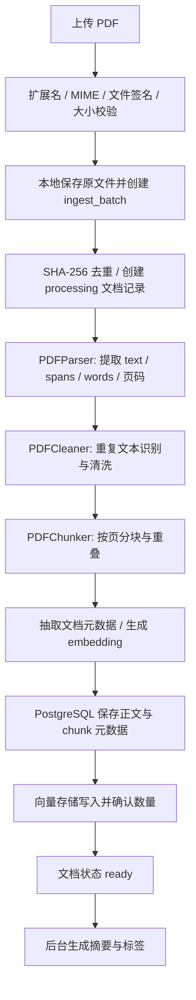
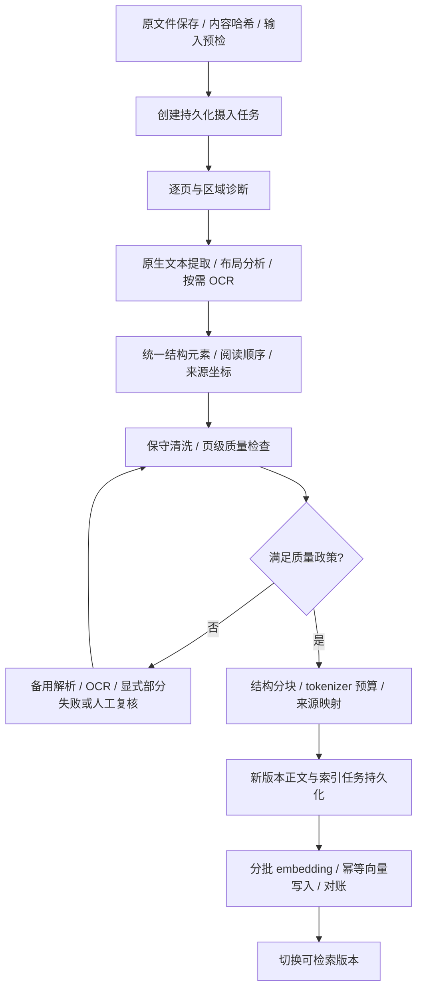

**PDF 入库复核、修复路线与面试回答（2026-09-26）**

当前项目已经具备 PDF 文本入库的基础闭环，但复杂 PDF 的完整性和结构正确性还没有保障。主要问题是：扫描页未执行 OCR，清洗可能误删正文，双栏阅读顺序可能被破坏，分块预算不可靠，以及缺页文档仍可能被标记为 `ready`。修复应先阻止静默丢失，再接入结构化解析器，最后完善可恢复的入库任务与评测。

本报告以当前工作区代码为准，基准提交为 `b121a9a`；没有把设计文档中的目标能力当成实际实现。外部资料来自 PyMuPDF、Docling、PaddleOCR、Unstructured 和 Azure 官方文档，访问日期均为 2026-09-26。“规范化流程”指根据这些资料和本项目约束整理的工程方案，并非某个强制行业标准。本次没有修改业务代码，也没有接入新的解析引擎。

验证包括代码审查、生成 PDF 与构造页面数据的离线复现，以及现有入库/上传单测。当前 `data` 下没有找到可用于复核的真实 PDF；旧文档提到的 `pi0.pdf` 和“减少 75.8%”没有在本次重新测量。外部解析器也没有在本项目上做横向准确率或性能测试。

当前真正执行的链路如下，入口见 [documents.py](/home/guozy/Research-RAG-Agent/src/api/documents.py:161)，主流程见 [pipeline.py](/home/guozy/Research-RAG-Agent/src/core/ingest/pipeline.py:198)。



重复且状态为 `ready` 或 `processing` 的文档会提前返回。上述主链路由上传请求直接 `await`，后台任务只有摘要与标签；目前不能描述为“上传后立即进入持久化异步解析队列”。向量后端由配置选择，支持 Milvus 或进程内开发索引。

| 环节 | 当前真实逻辑 | 面试时可以准确表达的能力边界 |
|---|---|---|
| 上传 | 文件扩展名、声明 MIME、`%PDF-` 签名、空文件与大小检查；独立目录保存文件 | 有基础输入校验；不等于已完成页数、解析内存、耗时、加密文件等资源与兼容性控制 |
| 去重 | 按整个文件字节的 SHA-256 查询，数据库有唯一约束 | 有文件级幂等基础；同内容不同字节不一定去重，解析版本也没有纳入派生结果身份 |
| 解析 | `get_text("text", sort=True)`；逐 span 保存文字、bbox、字号；另取 words | 有坐标与字号信息；当前所谓 blocks 实际被展平成 spans，没有完整语义结构 |
| 扫描判断 | `len(text)/(width*height) < 0.01` | 只有启发式标签；没有 OCR 调用，也没有扫描区域识别 |
| 清洗 | 上下区域收集重复文本；高质量文本走文本行删除；低质量文本走位置过滤与重建 | 是规则清洗，具有误删风险，不能称为可靠版面恢复 |
| 分块 | 按页；普通分支按双换行、句子、空格词数；扫描分支按词窗口；再加同页 overlap | 当前是规则分块；默认 384/128 的单位是空格分词数，不是 tokenizer token |
| 元数据 | 字号、位置等规则提取标题、作者、年份、目录 | 已有启发式文档目录；PDF chunk 尚未利用目录进行章节感知分块 |
| 可追溯 | 原文件保留，chunk 带 1-based 页码，检索时从 PostgreSQL 回填正文和来源 | 已能定位到 PDF 页；不能精确定位到页面上的文字框或表格单元格 |
| 入库一致性 | 检查 embedding 结果；先提交正文，再写向量；确认写入数量后 `ready`；异常时补偿删除 | 有异常处理与补偿基础；不是跨库原子事务，也没有崩溃后的持久化恢复闭环 |

需要先纠正几处容易在面试中说错的内容。

- [pdf_parser_enhanced.py](/home/guozy/Research-RAG-Agent/src/core/ingest/pdf_parser_enhanced.py:12) 没有被生产入库流程引用。其输出还缺少 `file_type`，直接注入当前 pipeline 会触发类型校验失败。重建逻辑把页面高度的一半用于比较横坐标，并把页面下半部分全部归入左栏；表格判断也只是占位实现。文件名“增强版”不能作为已实现多栏、表格、公式支持的证据。
- [settings.py](/home/guozy/Research-RAG-Agent/src/config/settings.py:91) 中 `use_ocr=True`、`ocr_lang` 和可选 `paddleocr` 依赖没有接入实际解析路径，打开配置不会自动产生 OCR。
- [working_document.md](/home/guozy/Research-RAG-Agent/working_document.md) 中的 OCR、表格结构、公式 LaTeX、512–1024 token 分块等属于设计目标。当前 PDF 输出的 chunk 类型全部为 `text`。
- 旧 [pdf_fix_plan.md](/home/guozy/Research-RAG-Agent/docs/pdf_fix_plan.md) 中“增加 `sort=True` 和 words”已经部分成为现有实现，但 words 没有被 PDFCleaner/PDFChunker 消费；这并没有形成版面恢复闭环。
- 旧文档“`sort=True` 仅按 block 排序”的概括不适用于当前所有输出格式。PyMuPDF 官方说明：`text`、`words` 会重建文本行；v1.24.11 修改了二者的排序行为。它能改善阅读顺序，但仍不能据此保证跨栏、表格、脚注等结构正确。[R1]
- 仓库中的部分诊断脚本使用旧 `DocumentChunker`，真实 pipeline 使用 `PDFChunker`。旧脚本结果不能直接证明现行入库分块质量。

下面的问题按“已复现”和“代码风险/能力缺口”分别标注。P0 表示建议优先修复的完整性或基本可用性问题，P1 表示随后完善；这不是线上故障等级认定。

| 优先级 / 证据 | 缺陷与触发条件 | 后果 | 对应修复 |
|---|---|---|---|
| P0 / 已复现 | 扫描判断阈值过粗，且扫描路径无 OCR | 原生页误标扫描；纯图片页无可检索正文 | 按页/区域判断文本可用性，组合字符、乱码、图片覆盖等信号；接入 OCR；未处理页必须显式报告 |
| P0 / 已复现 | 只检查整份文档是否至少生成一个 chunk | 原生页与图片页混合的 PDF 可漏掉整页仍显示 `ready` | 记录每页处理结果、原因与质量；设置质量门禁，允许显式部分完成或要求处理全部必要页面 |
| P0 / 已复现 | 低质量分支直接过滤页顶 25%、页底 20% 内的文本块 | 标题、摘要、底部结论和脚注可能丢失 | 区域只用于生成候选；结合跨页重复、角色、位置进行删除；保留原始元素和删除理由 |
| P0 / 已复现 | 分块用 `split()` 计数；部分长句路径不做硬切分；扫描窗口与最终 overlap 重复 | 中文超长块、重复证据、输入超限或截断风险 | 使用实际 embedding tokenizer；统一预算；只加一次重叠；所有路径有最终长度校验 |
| P1 / 已复现 | 降级重建按 `(y,x)` 排序，把相同高度的左右栏拼接 | 原文语义顺序错误，检索命中也不能作为正确证据 | 先识别区域、跨栏标题和栏，再建立区域内/区域间阅读顺序；困难页转结构化解析器 |
| P1 / 已复现 | 跨项目去重只更新数据库关联，向量中的 `project_ids` 未更新 | 新项目能关联到文档，但按项目过滤时搜不到其已有向量 | 明确项目关联的权威来源；通过 outbox 同步索引过滤字段，或调整候选过滤设计 |
| P1 / 代码风险 | 页眉页脚频率按 span 出现次数统计，不按不同页面统计；文本分支不使用位置 | 同页重复片段可能被算作跨页重复；正文中的同名文本也可能被删除 | 按页面去重统计，归一化页码；删除动作回到具体 bbox 和元素角色 |
| P1 / 已复现 | `_filter_page_numbers()` 把页码从“待删除候选”排除；良好文本分支无独立页码删除 | 页码可能保留在正文中 | 增加边缘区域内的页码专用规则，避免把正文数字当作页码 |
| P1 / 能力缺口 | 表格、公式、图片没有独立结构；bbox 未传入 chunk | 表头与数值失联，公式含义损失，无法做精确原文定位 | 建立统一元素模型，保留表格单元格、公式、图片引用、来源框及关系 |
| P1 / 代码风险 | 上传中直接运行同步解析、同步 HTTP embedding、同步向量写入；整份 chunks 一次请求 | 大文件占用请求与事件循环，超时、内存和服务批次上限不可控 | 持久化任务队列与 worker；分阶段限时、分页处理、按 token/条数分批 embedding |
| P1 / 代码风险 | 仅异常捕获补偿，没有持久化索引任务与对账 | 进程崩溃可能留下 `processing`、孤儿向量或不完整派生数据 | outbox、幂等写入、重试与对账；发布版本时才对检索开放 |
| P1 / 能力缺口 | 未保存 parser/model/config 版本、页级质量、完整解析中间结果 | 不能可靠比较解析升级前后，也不能只重做分块而复用解析 | 原文件与版本化解析产物分层保存，生成新派生版本并验证后切换 |

上述主要代码位置是 [PDFParser](/home/guozy/Research-RAG-Agent/src/core/ingest/pdf_parser.py:18)、[清洗质量判断](/home/guozy/Research-RAG-Agent/src/core/ingest/pdf_cleaner.py:94)、[位置过滤](/home/guozy/Research-RAG-Agent/src/core/ingest/pdf_cleaner.py:184)、[PDFChunker](/home/guozy/Research-RAG-Agent/src/core/ingest/pdf_chunker.py:7)、[去重分支](/home/guozy/Research-RAG-Agent/src/core/ingest/pipeline.py:80) 和 [embedding 客户端](/home/guozy/Research-RAG-Agent/src/core/retrieval/embedder.py:38)。

几个细节解释了为什么“程序运行成功”仍会得到有问题的知识库。

1. A4 页面约为 `595 × 842` 个 PDF point，阈值 `0.01` 相当于少于约 5010 个提取字符就标为扫描页。这并非“无文本”的判断，而且对页面单位、语言和排版非常敏感。本次一页包含 999 个提取字符的原生 PDF 被标为扫描页，但仍产生了文本 chunk；误分类会改变分块策略，不代表所有误分类页都立即丢失。
2. 中文并非不能通过 `isalpha()`；真正的问题包括无空格中文、短标题、数字表格在 `split()` 至少三个词和字母占比这两个条件上容易被判低质量。进入位置过滤后，只要中部还剩一点文字，代码就采用它，不会因为部分内容被删而回退。当前回退只覆盖“重建结果完全为空”，没有正文完整性比较。
3. 扫描分支已经以 `chunk_size-overlap` 为步长滑动窗口，之后 `_apply_overlap()` 又把上一块尾部加到下一块。大小 8、重叠 2 时，第二块开头出现 `w06 w07` 两遍。默认设置也会叠加，不能把问题简单归为调参。
4. 普通分支遇到“当前已有短句，下一句本身超长”的情况，会先输出短句，再把整条长句放进新块，结束时不一定继续硬拆。本次大小 8、重叠 0，得到长度 3 和 12 的两块。即使修复此分支，现有“先装满再加 overlap”也会让最终块超过初始大小，必须先明确大小是正文预算还是最终预算。
5. 同页 overlap 避免了当前页码标签与跨页文本不一致，属于已有优点。但逐页处理也会割裂跨页段落/表格；升级时需要元素级多来源定位，不能只移除页边界限制。
6. PostgreSQL chunk 在向量写入前已标 `active`，检索回填查询没有限制 `Document.status == ready`。若向量已部分可见而状态尚未完成，现有 `ready` 标记并非严格发布屏障。要将“写入中”和“可检索版本”分开设计。
7. 去重路径使用先查询后创建，唯一约束能阻止重复行，但尚未完整处理并发冲突与任务归属。真实 AsyncSession 下还应验证 `existing.projects` 的显式预加载，避免同步访问懒加载关系；本次 SQLite 适配器复现不覆盖该异步数据库行为。

离线验证结果保存在 [原始证据 JSON](/home/guozy/Research-RAG-Agent/docs/pdf_ingestion_evidence_20260926.json)。本地 PyMuPDF 版本为 `1.27.2.2`。

| 场景 | 实际结果 | 验证范围 |
|---|---|---|
| 生成原生文本 PDF | 999 字符，`is_scanned=true` | 真正调用现有 PDFParser/Cleaner/Chunker |
| 将该页渲染成图片，再嵌入新的 PDF | 0 字符，0 chunk | 证明当前没有对图片页执行 OCR |
| 原生页 + 图片页的两页 PDF | `ready`、`page_count=2`，只有第 1 页被索引 | 运行现有 pipeline；本地 SQLite 适配器、固定向量和内存索引 |
| 同一文件关联到第二个项目 | 数据库关联 p1/p2；向量仍只有 p1；p2 过滤结果为 0 | 同上；不是线上 PostgreSQL/Milvus 实测 |
| 页顶/中部各一行无空格中文 | 重要结论被删，只剩中部正文 | 构造 parser 输出，调用现有 cleaner |
| 两栏各两块数字内容 | `111→222→333→444` 被重建为 `111 333 / 222 444` | 构造已知阅读顺序，验证降级重建；不代表所有双栏 PDF 都失败 |
| 大小 8，扫描窗口 overlap 2 | 第二块前缀重复两次 | 调用现有 chunker |
| 大小 8，短句后跟 12 词长句 | 块长度 `[3,12]` | 调用现有 chunker |
| 大小 8，3200 字符无空格中文 | 一整块，计数为 1 个“词” | 只证明计数失真，不声称已触发特定模型截断 |

现有检查命令和结果：

```bash
python -m pytest -q tests/unit/ingest tests/unit/api/test_document_upload_validation.py
# 27 passed in 1.98s
```

这些测试覆盖格式契约、页码、元数据、状态与部分补偿逻辑，但不能作为复杂版面、OCR、阅读顺序或表格正确性的验收。后续应把上表的失败场景纳入回归用例；当前报告只记录复现，没有把断言正确结果的失败测试加入常规测试集。

公开方案最值得借鉴的是处理层次和结构化输出，而不是选择一个名字后宣称“企业级完成”。

| 官方方案 | 文档中能确认的能力 | 本项目可借鉴的设计 | 选型边界 |
|---|---|---|---|
| PyMuPDF [R1] | 原生文本与坐标提取、排序；通过 `get_textpage_ocr()` 调用 Tesseract，返回 TextPage | 保留快速文本通道；必要时显式 OCR，再使用该 TextPage 提取 | `sort=True` 不保证复杂语义结构；OCR 后仍需处理阅读顺序 |
| Docling [R2] | 版面、阅读顺序、表格结构、公式等文档理解；统一 DoclingDocument；OCR 与多种导出 | 作为统一结构化表示和复杂 PDF 解析适配器的优先 PoC 候选 | 所用 pipeline、模型、OCR 配置影响能力；在本项目语料上尚未验证 |
| PaddleOCR PP-StructureV3 [R3] | 布局检测、表格/公式识别、多栏阅读顺序、Markdown 输出等 | 中文扫描资料与复杂页面的 PoC 候选，评估与 Docling 的实际效果 | 需要相应模型及运行环境；可选模块需显式配置，不能因装了依赖就声称已支持 |
| Unstructured [R4][R5] | `auto/fast/hi_res/ocr_only` 策略；基于元素的分块、表格隔离、标题边界、原元素信息 | 解析策略路由；先识别元素再分块；只在有必要处使用 overlap | 文档中的分块限制是字符数，接入本项目后仍要适配 embedding 的 token 预算 |
| Azure Document Intelligence Layout [R6] | OCR、段落角色、表格、图、sections、spans 和 bounding regions 等结构 | 可参考其结构契约与来源定位，也可在条件允许时做托管服务对照 | 实际 API 版本、语言、配额与费用均需核验；其部分自然阅读顺序选项有语言限制 |

当前建议保留 PyMuPDF 作为简单页面的低成本通道，以 Docling 为统一结构适配的首个候选，针对中文扫描件用 PP-StructureV3 做第二个候选对照。最终选择由同一批标注样本决定。如果采用某解析器自己的 OCR/布局流水线，就由适配层协调模块，避免每页重复运行两套完整 OCR。无需一开始把所有引擎串联起来。

PyMuPDF 提供的最小 OCR 接入在概念上是“先 OCR 得到 TextPage，再从该 TextPage 取文本”，不是简单将 `is_scanned` 改为 true。PaddleOCR/Docling 等引擎也需要显式调用和结果适配。对同页同时存在可用文本层和图片文字的情况，要按区域合并并去重；只判断整页是否有文字会漏掉图片里的正文。空白页、图表页、封面、损坏字体映射页也应区分，不能一概判为扫描件。[R1][R2][R3]

推荐的规范化流程如下。页面质量不合格时进入回退或复核，达到明确的完整性政策后才发布可检索版本。



各步骤的实际落地可以按以下顺序组织。

1. **预检和任务身份。** 验证文件能打开、加密状态、页数、页面尺寸与资源预算；保存原始字节和哈希。为原文件、解析版本、分块版本和索引版本分别建立身份。状态建议区分排队、解析、质量检查、索引、完成、部分完成、失败；租约和重试次数用于恢复任务。状态名称可按项目规模简化。
2. **路由和解析。** 用字符/词数量、字符可读性、文字框覆盖、图片覆盖、旋转和布局复杂度等信号评估页面。原生文字可靠时保留原生结果；扫描/文字层不可用区域启用 OCR；复杂布局进入结构解析。多栏应先划分区域和跨栏元素，再按具体语言的阅读规则排序，不能假设全页永远左上到右下。
3. **统一中间表示。** 用 element 表示标题、段落、表格、公式、图片、图注、页眉页脚等，保留层次关系、阅读顺序和来源。派生的 Markdown 用于展示或模型输入；JSON 中间表示用于可追溯、重跑和评测。这样换解析器时，下游不依赖某个库的私有返回格式。
4. **保守清洗。** 保留原始文字，把规范化文字和删除标记作为派生结果。页眉页脚依赖位置、跨页重复率和角色联合判断；脚注默认保留或关联到正文。连字、断词、乱码处理需关注代码、公式和语言差异。对疑似正文误删、空页异常、阅读顺序异常触发回退，不能只检查字符总量。
5. **结构化分块。** 优先按章节、段落、列表、表格单元组织；超长元素才降级到句子和 tokenizer 窗口。表格按行组拆分时重复必要表头并保留单位、caption、单元格关联；公式保留规范表达与解释；图像保留引用及原文图注。跨页合并时为每段内容保存各自来源，不能只贴一个页码。
6. **受预算约束的 embedding。** 使用实际模型 tokenizer，设置目标长度与最终硬上限，把标题前缀和 overlap 都计入预算；不要把词、字符、token 混用。可用 512 token 目标、64 token overlap 作为对照实验的一组配置，绝不是统一最优值。按文本条数和总 token 分批，设置超时、有限重试和背压；校验数量、维度、数值有效性与响应索引映射。
7. **可靠落库与发布。** PostgreSQL 保存权威正文、版本和定位；同一事务内记录待构建索引的 outbox 任务。worker 重试 embedding 和向量 upsert，确认所有预期 chunk 后将新版本标为可检索；失败版本不进入检索。跨数据库无法靠一次普通事务原子提交，需以幂等、对账和发布屏障实现最终一致性。现有 `VectorStore` 只有 insert/delete，若采用 upsert 必须扩展并验证后端契约。
8. **质量与运营闭环。** 保留每页解析状态、所用引擎/模型/配置、警告、耗时、成本和异常类型。对低置信度结果建立可重试和可复核路径；模型自产生的置信度需校准，不等于正确率。人工修正也应关联原始元素与派生版本。

统一中间表示可以从下面的最小契约开始。这是建议结构，当前尚未实现；字段不是某个外部产品 API 的原样复制。

```json
{
  "document_id": "...",
  "content_hash": "sha256:...",
  "parse_version": "...",
  "parser": {"name": "...", "version": "...", "model": "...", "config_hash": "..."},
  "pages": [{"page_num": 1, "status": "ok", "method": "native", "warnings": []}],
  "elements": [{
    "element_id": "p1-e7",
    "type": "paragraph",
    "raw_text": "...",
    "text": "...",
    "section_path": ["方法", "模型结构"],
    "reading_order": 7,
    "parent_id": "section-2",
    "source": {
      "page_num": 1,
      "bbox": [0.1, 0.2, 0.9, 0.3],
      "coordinate_system": "normalized_top_left",
      "page_rotation": 0
    }
  }],
  "chunks": [{
    "chunk_id": "...",
    "text": "...",
    "token_count": 320,
    "sources": [{"element_id": "p1-e7", "char_start": 0, "char_end": 120}],
    "context_sources": [],
    "chunker_version": "..."
  }]
}
```

表格元素还应保存行列、跨行跨列和表头关系；公式可保存 LaTeX 与原始图片引用；图片描述应标为模型生成的派生内容，避免把推测写成原文事实。`sources` 和 `context_sources` 区分正文证据与为检索增加的标题/重叠上下文，引用时更容易回到准确位置。页码需要说明是 PDF 物理页索引还是页面印刷页码，当前项目使用前者。

工程修复建议分三批执行，每批都有可核验的退出条件。

| 批次 | 具体变更 | 涉及现有模块 | 退出条件 |
|---|---|---|---|
| 第一批：阻止静默丢失 | 修复区域无条件删除；页码规则独立；扫描待处理状态与逐页完整性检查；修复双 overlap、长句超限、中文计数和参数合法性 | PDFParser、PDFCleaner、PDFChunker、pipeline、相关 schema | 上述缺页/误删/超限复现转为正确结果；未支持的扫描页明确提示，不能伪装成全量成功 |
| 第二批：补齐解析能力 | 统一元素与来源契约；接入一个布局/OCR 适配器；按结构分块；保留解析产物与版本；同步项目索引关联 | ingest 各模块、metadata、Chunk 元数据、citations、检索过滤 | 标注语料上能核验阅读顺序、表格、文字与定位；新项目能检索关联文档；新旧索引可回滚 |
| 第三批：生产运行保障 | 持久化 worker、outbox、分批 embedding、租约与重试、版本发布、对账与监控 | API、pipeline、数据库迁移、VectorStore、检索回填 | 注入超时、部分写入、进程中断和并发重复上传后可恢复，无未发布版本混入结果 |

跨项目关联错误与幂等问题可以和第一批并行修复，取决于系统是否已经频繁复用文档。第一批的“显式标注未支持”只是止损；宣称支持扫描 PDF 仍必须在第二批接通真实 OCR 并通过样本验证。

已有 `ready` 文档需要重建派生数据：修复代码后直接重传同一文件，会被当前哈希去重短路，仍然复用旧结果。建议增加显式重解析操作，使用原文件哈希加解析/模型/配置版本识别新产物；新版本完整通过质量与索引检查后再切换，保留旧版本供回滚。不要通过批量删除知识库来完成升级，也不能只重建向量而沿用已经误删的旧 chunk。

质量评估应同时验证解析结果和下游 RAG，不能只用“字符保留率”和“接口成功率”。

| 评测层 | 样本/指标 | 判断方法 |
|---|---|---|
| 覆盖与误删 | 原生/扫描/混合、空白页、首尾正文、脚注、中文短段落；未处理必要页数量、正文元素保留率、错误删除率 | 必须区分预期空白与漏页；使用人工标注的正文，而非把页眉噪声也计入保留率 |
| 文字识别 | 中文、英文、旋转、低清、损坏字体映射；CER/WER | 按语言和文档类别报告，保留错误分布 |
| 阅读顺序 | 双栏/三栏、跨栏标题、脚注、图注；元素顺序或成对顺序准确率 | 基于已对齐的人工阅读顺序评估，不能用字符数量替代 |
| 表格/公式 | 跨页表格、合并单元格、单位、公式；结构与单元格正确率、规范化公式正确率 | 表格可使用 TEDS 等结构指标，配合实际数值问答；不要只看导出的 Markdown 是否美观 |
| 分块 | tokenizer 最终硬上限、重复片段、章节/表格边界、短尾块 | 硬上限覆盖全部路径；overlap 只执行一次且来源准确；不要把所有重复文字都当作错误 |
| RAG 效果 | 标注问题与证据；Recall@k、MRR/nDCG、回答证据支持率、引用页/框正确率 | 固定 embedding、reranker、生成模型等变量，对照解析/分块方案；无法回答的问题允许拒答 |
| 运行成本 | 每页与每文档耗时、p95、OCR 触发率、内存峰值、模型调用成本、重试率 | 用部署目标上的真实文档测量，不照搬产品宣传速度 |
| 可靠性 | 重复上传、跨项目、服务超时、部分插入、进程中断 | 验证状态可恢复、索引无重复/孤儿、项目过滤一致、只返回发布版本 |

建议先建立一个覆盖主要类型的 30–50 份小型标注集，按文档划分调参与保留集；这是起步规模建议，不是现有测试规模或统计充分性保证。所有“准确率达到多少”“吞吐提升多少”都应来自固定数据集和环境下的对照结果。官方引擎支持某项能力，不代表本项目已经达到某个准确率。

面试时可以先讲清楚自己实际做了什么，再讲发现的问题、证据和改进方向。下面这段约两分钟的回答严格对应当前实现：

> 我把 PDF 入库拆成文件校验、解析清洗、分块、向量化和可追溯落库几个阶段。当前版本用 PyMuPDF 提取文本、字号和坐标，保留原文件和页码；按页做规则清洗与分块，PostgreSQL 保存正文和来源信息，向量后端做检索。入库会做文件哈希去重、embedding 结果检查，向量写入数量确认后才更新完成状态，异常时有补偿删除。
>
> 这套实现里，我最关注的是能否把正确证据完整地送入检索。复核后发现了几个具体问题：扫描页只有标记没有 OCR，混合 PDF 可能漏掉整页仍显示成功；清洗降级逻辑可能误删页顶正文；分块按空格计数，对中文不可靠，扫描窗口还有重复 overlap。它们不是换一个 embedding 模型就能解决的问题。
>
> 下一步我会先修复这些可复现的完整性问题，再引入统一的文档元素结构，按页面和区域选择原生提取、布局分析或 OCR，保留章节、表格、公式与来源坐标。分块按结构进行，用 embedding 模型的 tokenizer 控制最终预算；对难页做显式回退和质量检查。更高并发下再把摄入拆成可恢复任务，用幂等写入、outbox 和索引对账保证版本发布的一致性。
>
> 当前已经有的是基础入库、元数据和页级追溯；复杂版面 OCR、多模态结构和持久化任务是改进方案。我会用正文保留、阅读顺序、引用定位，以及下游检索召回来验收，拿实际评测结果决定解析器和分块参数。

被继续追问时，可以使用下面的回答要点。注意把“已做”与“计划”保持一致。

| 面试官追问 | 可用回答 |
|---|---|
| “PDF 解析不就是调一个库吗？” | 库负责提取基础信息；我需要定义解析结果契约，处理顺序、清洗、边界、来源、失败与版本，并验证最后入库的证据是否完整。当前已经能指出并复现漏页与误删，后续用固定回归集验证修复。 |
| “为什么 PDF 会读乱？” | PDF 常保存绘制指令、字形和坐标，不一定包含完整阅读结构。按坐标排序能处理一部分情况；跨栏标题、脚注、表格需要先识别区域与关系，再恢复顺序。当前 `sort=True` 是基础能力，复杂布局还有缺口。 |
| “扫描件怎么判断？为什么不全量 OCR？” | 文本少只是信号，还要区分封面、空白页和图片区域。对可用文字层优先保留原生结果，避免 OCR 引入错误与成本；对无可用文字的区域显式 OCR，混合页去重合并。当前项目尚未接通这个分支。 |
| “为什么 384，为什么 overlap 128？” | 这是当前实现的空格词数配置，没有可靠 token 等价关系，也不能说它经过最优验证。我会先修正 tokenizer 预算与重复 overlap，再比较不同大小对召回、上下文完整性和成本的影响。 |
| “怎么做语义分块？” | 先基于标题、段落、列表、表格等结构组织；超长元素再拆句子或 token 窗口。当前属于规则分块，没有采用 embedding 相似度断点或 LLM 分段，因此不会把它宣传成已实现模型驱动的语义切分。 |
| “表格、公式、图片怎么处理？” | 表格保留表头、单元格和单位，超长表格按行组拆并携带表头；公式保留可验证表达与上下文；图片保留原图和图注，模型描述单独标注为派生结果。目前 PDF 入库还是 text chunk，这部分需要引擎与契约升级。 |
| “怎么确认没有丢内容？” | 对每页建立处理台账，保留原始元素和清洗动作；对必要正文、表格等做覆盖检查。字符数正常仍可能顺序错或正文被噪声替换，所以还要检查结构和下游证据定位。 |
| “PostgreSQL 成功、Milvus 失败怎么办？” | 当前有异常补偿，但崩溃时不能保证执行。生产方案是在数据库事务内记录 outbox，worker 幂等重试向量写入，完成对账才发布新版本，并定期修复孤儿记录；这是最终一致性，不是跨库强事务。 |
| “解析器升级后旧文档怎么办？” | 原文件可以保持内容哈希不变，但解析与分块产物需要新版本。先构建并评测新版本，再切换可检索版本；当前仅哈希去重会阻止重解析，需要增加显式重建路径。 |
| “你有哪些真实指标？” | 本次入库/上传的 27 项既有单测通过，并复现了几类确定缺陷。还没有真实复杂 PDF 的准确率、吞吐和解析器对照数据，所以不会报没有测过的 95% 或提升百分比。 |

对应的官方资料如下，文中 `[R1]` 等标记与此表对应；能力概括仅覆盖本次阅读确认的内容。

| 编号 | 官方链接 | 本次采用的依据 |
|---|---|---|
| R1 | [PyMuPDF Page API](https://pymupdf.readthedocs.io/en/latest/page.html#Page.get_text)；[OCR API](https://pymupdf.readthedocs.io/en/latest/page.html#Page.get_textpage_ocr) | 不同输出类型的 sort 行为、v1.24.11 变更、OCR TextPage 与阅读顺序注意事项 |
| R2 | [Docling 官方文档](https://docling-project.github.io/docling/) | 统一文档表示、布局/阅读顺序/表格等能力、OCR 与导出 |
| R3 | [PaddleOCR PP-StructureV3 官方说明](https://github.com/PaddlePaddle/PaddleOCR/blob/main/docs/version3.x/pipeline_usage/PP-StructureV3.en.md) | 布局分析、表格与公式、多栏顺序、结构化结果与 Markdown |
| R4 | [Unstructured partitioning strategies](https://docs.unstructured.io/open-source/concepts/partitioning-strategies) | 按文档条件选择 fast、hi_res、ocr_only、auto |
| R5 | [Unstructured chunking](https://docs.unstructured.io/open-source/core-functionality/chunking) | 基于元素分块、标题边界、表格隔离、overlap 与 orig_elements |
| R6 | [Azure Document Intelligence Layout](https://learn.microsoft.com/en-us/azure/ai-services/document-intelligence/prebuilt/layout?view=doc-intel-4.0.0) | 几何/逻辑角色、段落/表格/图、spans 与 bounding regions、版本和语言边界 |
